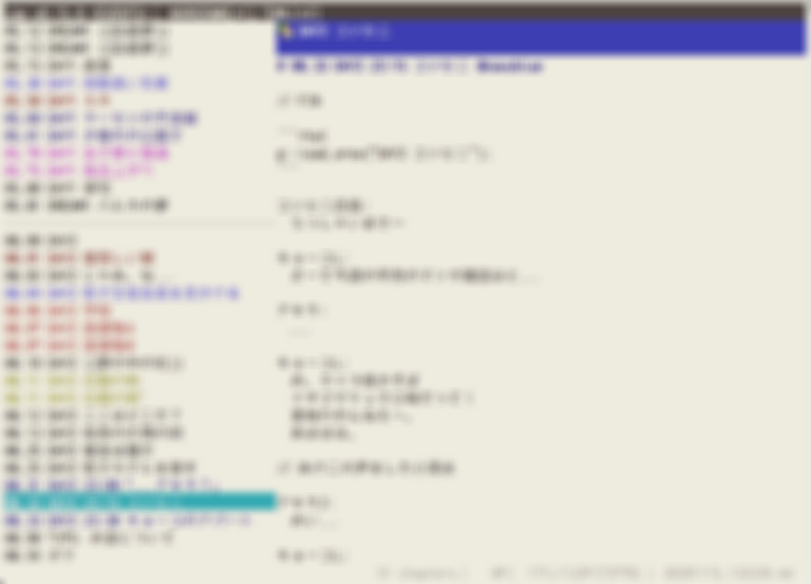

### Hi there 👋

I am a Japanese software developer. <!-- and I write English with the help of DeepL Translator.-->
<!-- https://japantoday.com/category/features/opinions/why-are-japanese-so-bad-at-english -->

### 🔭 I’m currently working on:

- I develop business software and indie games.
  - **These days, I spend more time writing level design and pixel art than writing code.**
- I do most of my work outside of GitHub. so those activities don't show up in my GitHub account activities.
  - The development of the game itself has been slow, but I've been using Rust🚀, [GTK4](https://gitlab.gnome.org/GNOME/gtk/-/merge_requests?scope=all&state=merged&author_username=sumibi-yakitori), [tui](https://github.com/fdehau/tui-rs), [iced](https://github.com/iced-rs/iced) and [tetra](https://github.com/17cupsofcoffee/tetra) to create several in-house tools, some of which are listed below.
    - [As for GTK4, I am continuing to follow up to get this working on macOS.](https://gitlab.gnome.org/GNOME/gtk/-/merge_requests?scope=all&state=all&author_username=sumibi-yakitori)

  **A context-aware dual-pane file manager**
  
  

  
  **A story editor in TUI**

  

  **A sticky board**

  

### 👯 I’m looking to collaborate on:

  - I would be happy to have a friend who can work with me to create a beautiful, minimalist game that I am really looking for.
Preferably someone who prefers 2D indie games.
  - I am currently working on a very old-fashioned JRPG. I'd be happy to get to know people who are interested in writing pixel art, music compose, [landscape design for locations and dungeons, level design, story writing](https://minahito.wordpress.com/2012/09/01/planner-one-of-disciplines-in-japanese-video-game-industory/), localization, etc., as well as engineers.
  - If you want money, I may be able to introduce you to remote work. But that may not be game development. I also like to develop business software.
  - I haven't had much time to play games lately, but these are some of the games that I have liked.
      - Splatoon 2, 3
      - Undertale
      - BotW
      - Celeste
      - Cave story
      - Terraria
      - FTL
      - Risk of Rain
      - VA-11 Hall-A
      - Katana ZERO
      - Stone Story RPG
      - etc..

  　　 My career as a game player started with the Famicom (NES), so I have played a lot of old games. Therefore, there are many games from that era that I like very much.
    

### 👻 Strange fact:

- Unusually for a programmer, I have also worked as an artist for game companies.
  - This is a model of a character that may appear in my game, She is a pathetic girl who has been ignored since she was created because someone who created her is involved in programming, story writing, and everyday life events.
  
  

### 📫 How to reach me:

- You can contact me at these locations.

  - [Game Development in Rust (Discord)](https://discord.gg/yNtPTb2)
<!--
- <strike>[rust-jp (Slack)](https://rust-jp.slack.com)</strike>
-->

<!--
**sumibi-yakitori/sumibi-yakitori** is a ✨ _special_ ✨ repository because its `README.md` (this file) appears on your GitHub profile.

Here are some ideas to get you started:

- 🔭 I’m currently working on ...
- 🌱 I’m currently learning ...
- 👯 I’m looking to collaborate on ...
- 🤔 I’m looking for help with ...
- 💬 Ask me about ...
- 📫 How to reach me: ...
- 😄 Pronouns: ...
- ⚡ Fun fact: ...
-->
