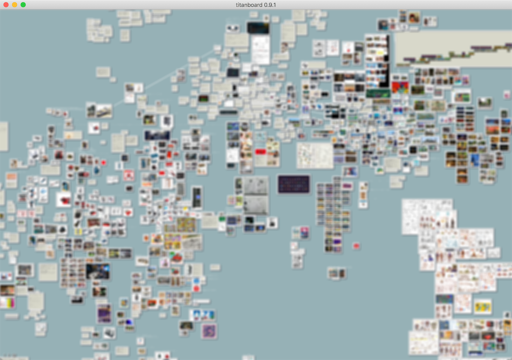

### Hi there 👋

I am a Japanese software developer, and I write English with the help of DeepL Translator.

**🔭 I’m currently working on ...**

- I develop business software and indie games.
  - **These days, I spend more time writing stories and pixel art than writing code.**
- I do most of my work in a secret Git server. so those activities don't show up in my GitHub account activities.

The development of the game itself has been slow, but I've been using Rust, iced, and tetra to create several in-house tools for game development, some of which are listed below.

**File manager**

**Sticky board**

**👯 I’m looking to collaborate on ...**

  - I would be happy to have a friend who can work with me to create a beautiful, minimalist game that I am really looking for.
Preferably someone who prefers 2D indie games.
  - What I am currently working on is a JRPG. I'd be happy to get to know people who are interested in writing pixel art, [landscape design for locations and dungeons, level design, story writing](https://minahito.wordpress.com/2012/09/01/planner-one-of-disciplines-in-japanese-video-game-industory/), localization, etc., as well as engineers.
  - If you want money, I may be able to introduce you to remote work. But that may not be game development. I also like to develop business software.
  - I haven't had much time to play games lately, but these are some of the games that I have liked.
      - Splatoon2
      - BotW
      - Celeste
      - Undertale
      - FTL
      - Risk of Rain
      - VA-11 Hall-A
      - Katana ZERO
      - Cave story
      - etc..

  　　 My career as a game player started with the Famicom (NES), so I have played a lot of old Japanese games. Therefore, there are many games from that era that I like very much.
    

**⚡ Fun fact:**
  - Unusually for a programmer, I have also worked as an artist for Japanese game companies.

<!--
**sumibi-yakitori/sumibi-yakitori** is a ✨ _special_ ✨ repository because its `README.md` (this file) appears on your GitHub profile.

Here are some ideas to get you started:

- 🔭 I’m currently working on ...
- 🌱 I’m currently learning ...
- 👯 I’m looking to collaborate on ...
- 🤔 I’m looking for help with ...
- 💬 Ask me about ...
- 📫 How to reach me: ...
- 😄 Pronouns: ...
- ⚡ Fun fact: ...
-->
