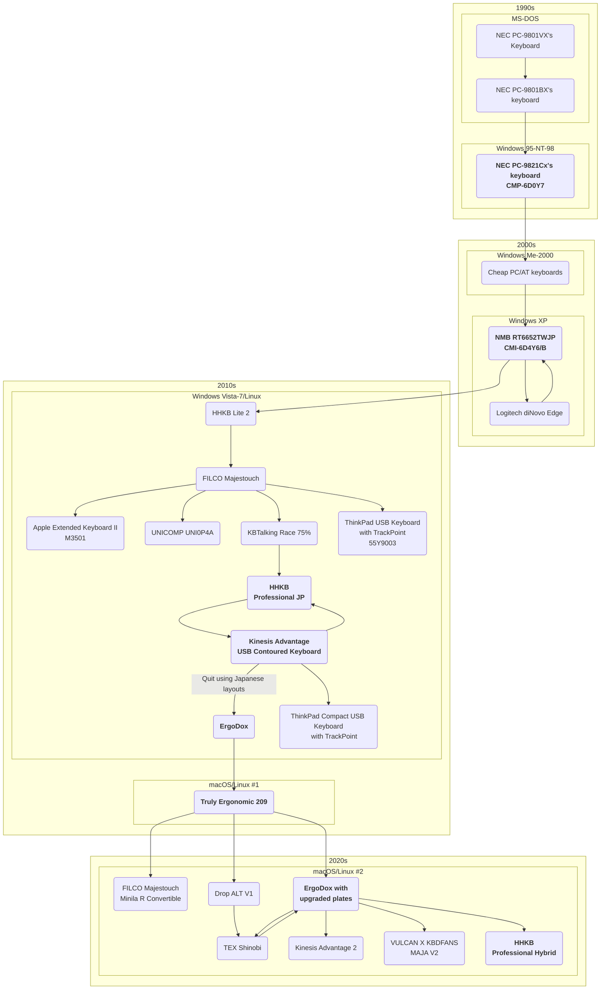

# HID Handbook

## Replacing HID switches

The circuits to which switches are soldered are likely to be through-holes.
If those hard-to-remove switches are heated for a long time using a desoldering wick, the land will be heated and easily damaged.
Therefore, as far as possible, use the FR-301[^DesolderingToolVideo][^FR-410] and a suitable nozzle to suck out the solder.

Also, when unplugging the internal cable connector, pull on the cable part to pull out the pins, so grab the connector and pull it out.

[^DesolderingToolVideo]: [Instructional videos on how to use the system do not exist on the Japanese language pages.](https://hakkousa.com/products/desoldering/desoldering-tools/fr-301-portable-desoldering-tool.html)
[^FR-410]: [The FR-410 product page is more informative about desoldering.](
https://www.hakko.com/japan/products/hakko_fr410.html)

## Keyboards

**HHKB**

- [Alternative controller for HHKB](https://hhkb.io/modding/controllers/)
- [Keycaps](https://www.pfu.ricoh.com/direct/hhkb/hhkb-option/detail_keytop.html)
- [Remapping is apparently possible with HHKB Classic](https://www.reddit.com/r/HHKB/comments/g9ciwp/remapping_the_classic_with_the_hhkbkeymaptool/)

## Pointing devices

### Microsoft Wheel Mouse Optical clones

**SteelSeries RIVAL 3**

This product has a heavy wheel click, but is otherwise a very good WMO clone. 

- Price: 3000-5000 JPY 

| Type          | Original parts | Replacement parts                                       |
| ------------- | -------------- | ------------------------------------------------------- |
| Middle button | Unknown        | [Panasonic EVQP0E07K](#evqp0e07k)[^EVQP0E07K][^nospace] |

[^nospace]: There is no space here for a 3-pin microswitch.
[^EVQP0E07K]: [Microswitch replacement in Kensington Orbit Scroll](https://www.reddit.com/r/Trackballs/comments/o8ai5q/microswitch_replacement_in_kensington_orbit_scroll/)

**ENDGAME GEAR XM1 RGB Gaming Mouse**

- Price: 3200 JPY, 59.00 USD
- Wider body than WMO
- Main switch feels very good
- Side buttons easy to press
- Wheel scrolls on it is heavy
- Good cable with soft fabric

| Type            | Original parts                 | Replacement parts |
| --------------- | ------------------------------ | ----------------- |
| Primary Buttons | Kailh GM 4.0 (60±5gf)          |                   |
| Middle button   | Kailh tactile switch (70±10gf) |                   |
| Microcontroller | 32bit STM ARM Cortex-M0 MCU    |                   |

**ROCCAT Burst Core**

- Price: 3400 JPY 
- The main switch is optical and is said to prevent chattering
  but the clicking sound is light and cheap but not that unpleasant
- Side buttons are large and easy to press
- Wheel scrolling on it is little heavy
- [Great review](https://www.reddit.com/r/MouseReview/comments/kg4cwk/roccat_burst_core_detailed_review_the_new_budget/?rdt=64162)

### Microsoft IntelliMouse Explorer 3.0 clones

<strong>SteelSeries RIVAL OPTICAL MOUSE</strong>

The rubber coating on the body of this product undergoes hydrolysis over time.

- Price: 6300 JPY 
- Release date: October 11, 2013

| Type            | Original parts         | Replacement parts |
| --------------- | ---------------------- | ----------------- |
| Primary buttons | Micro switch           |                   |
| Middle button   | TTC Micro switch       |                   |
| Rotary encoder  | Something 11 mm height | Alps EC10E1220503 |

### Others

<strong>ELECOM M-CAD01UBBK</strong>

- It has OMRON micro switches
- It does not feel bad to hold
- Some DCC tool operations also require both a middle button click and wheel operation,
  so if you have the time to replace the switch on a regular mouse to create the ideal mouse,
  I recommend you take that route

### Trackballs

- [USB dongle for remapping using RP2040 different from hasu's](https://www.reddit.com/r/Trackballs/comments/t7paeh/remapping_mouse_buttonsaxes_in_hardware_proof_of/?rdt=60108)
  - [Examples of use](https://yyoshisaur.hatenablog.com/entry/2023/11/08/120000)

**Kensington Orbit Wireless Trackball with Scroll Ring**

Because of its small size, it could be a better left-hand device for me than the slimblade if the switches is replaced.
The slimblade has a pointer that shifts when the ball is twisted.

- [Disassembly](https://yamori-jp.blogspot.com/2018/11/kensington-orbit-trackball-with-scroll.html)

**ELECOM IST Trackball(M-IT11DRBK)**

This product uses bearings in the trackball support mechanism. However, all button switches are heavy.
The heavy clicking of the main switches in particular leads to discomfort and fatigue as the time of use increases,
so it is advisable to replace these switches first and foremost.

| Type            | Original parts              | Replacement parts         |
| --------------- | --------------------------- | ------------------------- |
| Primary buttons | Kailh black body/red axis   | [OMRON D2F-01F](#d2f-01f) |
| Middle button   | Kailh black body/black axis | [OMRON D2F-01F](#d2f-01f) |
| Rotary encoder  | Something 11 mm height      | Alps EC10E1220503         |

## Switches

Depending on the construction of the mouse wheel, the microswitch D2F-01F seems to me to have a lighter click feel than the tactile switch EVQP0E07K, even at the same operating force.

### D2F-01F

[Specification](https://components.omron.com/us-en/products/switches/D2F)

| Type            | Description |
| --------------- | ----------- |
| Operating Force | 0.74N(75gf) |

### EVQP0E07K

[Specification](https://na.industrial.panasonic.com/products/switches-encoders-interface-devices/switches/lineup/light-touch-tactile-switches/series/79330/model/79472)

| Type            | Description |
| --------------- | ----------- |
| Operating Force | 0.74N       |

## Pens

**Mitsubishi Pencil Jetstream 0.38 SXE3400381P.T**

Even in the 2020s, Mitsubishi seems to be better than other stationery manufacturers in terms of writing quality.

## Links

- Softwares
  - Linux
    - [input-remapper](https://github.com/sezanzeb/input-remapper)
    - [piper](https://github.com/libratbag/piper/)
    - [Mouse buttons - ArchWiki](https://wiki.archlinux.org/title/Mouse_buttons)
- Disassembly
  - [A blog about taking apart mice and trackballs](https://michtw.blogspot.com/)
  - [Replacing the support mechanism of the Kensington Pro Fit Ergo Vertical with bearings](https://namachan10777.hatenablog.com/entry/2020/10/18/014710)
    > It should be noted that the static friction coefficient is small
- References
  - PC-98
    - [PC9801 Keyboard - tmk_keyboard wiki](https://github.com/tmk/tmk_keyboard/wiki/PC-9801-Keyboard)
    - [Valuestar in the Valuesky: The PC-9821 V13](https://nicole.express/2021/valuestar-in-the-valuesky.html)
    - [PC-98 Keyboards](http://nkmm.org/yagura/kbd/)
  - Removing yellowing(Ansho ouhen) from ABS plastics
    - [Retrobright - Wikipedia](https://ja.wikipedia.org/wiki/Retr0bright)
    - [Nogujyu Keyboard Mania - How to store the keyboards](http://www2s.biglobe.ne.jp/~qwerty/pc/keyboard.html)
- Reviews
  - 1990-2000s
    - [http://telcontar.net/](http://telcontar.net/)
    - [Atelier silencium](http://www5f.biglobe.ne.jp/~silencium/keyboard/index.html)
    - [Nogujyu Keyboard Mania](http://www2s.biglobe.ne.jp/~qwerty/pc/keyboard.html)
    - [Nogujyu Mouse Mania](http://www2s.biglobe.ne.jp/%7Eqwerty/mouse/)
  - 2000s
    - [Keyboard research(Formerly known as Kenjin)](https://ide-research.net/keyboard/)
    - [Qwerters Clinic](http://ex4.sakura.ne.jp/kb/)
    - [SANDY55](http://sandy55.fc2web.com/)
    - [Neko's trackball room](http://mineko.fc2web.com/box/tb-room/)
    - [Neko's keyboard room](http://mineko.fc2web.com/box/kb-room/)
    - [MouseFan](https://mousefan.telcontar.net/)
  - 2010s
    - [Deskthority Wiki](https://deskthority.net/wiki/)
    - [forPCActionGamer Wiki](https://wikiwiki.jp/fpag/%E3%83%9E%E3%82%A6%E3%82%B9%E3%81%AE%E3%82%B9%E3%82%A4%E3%83%83%E3%83%81)
  - 2020s
    - [Libertouch.net](https://libertouch.net/)
    - [blog](https://note.com/yatsuishi/n/nc3554dc0986e)
